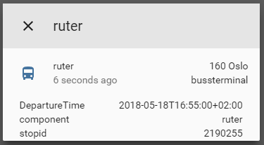

# custom_component to get info about next departures
A component which allows you to get information about next departure from spesified stop.  

To get started:   
Put `/custom_components/sensor/ruter.py` here:  
`<config directory>/custom_components/sensor/ruter.py`  


Example configuration.yaml:  
```yaml
sensor:
  - platform: ruter
    stopid: 2190400
```
 #### Sample overview
  
[Demo](https://ha-test-ruter.halfdecent.io)

This component is using the [Ruter reisapi](http://reisapi.ruter.no/Help) API to get the information.
This component is only usefull for users living near Oslo, Norway that uses Ruter for transportation.
  
To find the stopid go to [https://ruter.no/reiseplanlegger/Stoppested](https://ruter.no/reiseplanlegger/Stoppested) and search for your stop.
in the url after you have searched there will be an ID right after the "Stoppested/" in a format like this `(2190400)`, the numbers there is what you need to put in the `stopid:` config option.