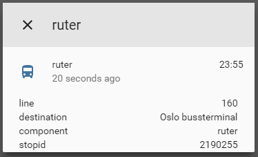

# custom_component to get info about next departures
A component which allows you to get information about next departure from spesified stop.  

To get started:   
Put `/custom_components/sensor/ruter.py` here:  
`<config directory>/custom_components/sensor/ruter.py`  


Example configuration.yaml:  
```yaml
sensor:
  - platform: ruter
    stopid: 2190400
```
 #### Sample overview
  
[Demo](https://ha-test-ruter.halfdecent.io)

This component is using the [Ruter reisapi](http://reisapi.ruter.no/Help) API to get the information.