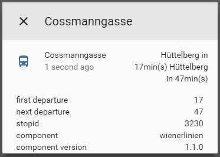

# custom_component to get info about next departures


A component which allows you to get information about next departure from spesified stop. 

To get started:   
Put `/custom_components/sensor/wienerlinien.py` here:  
`<config directory>/custom_components/sensor/wienerlinien.py`  


Example configuration.yaml:  
```yaml
sensor:
  - platform: wienerlinien
    stopid: 4429
    apikey: iuvds8793889dsd
```
 #### Sample overview
  
[Demo](https://ha-test-wienerlinien.halfdecent.io)

This component is using the [Wienerlinien API](http://www.wienerlinien.at) API to get the information.